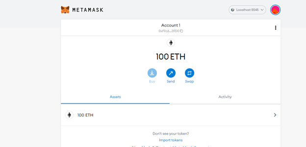
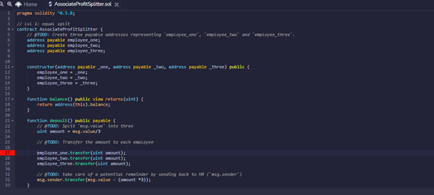
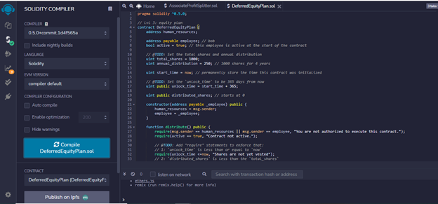
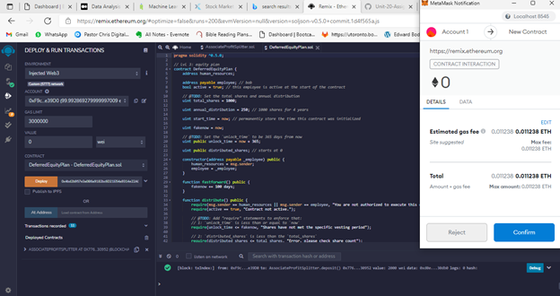
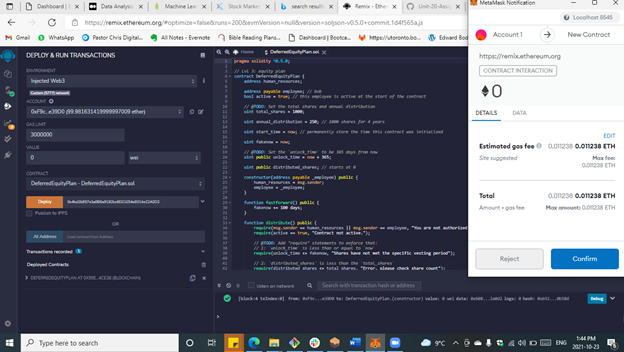
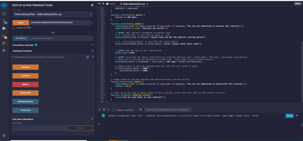

```python
```
# Unit-20-Assignment
## Instructions
Firstly, I opened up my crypto account on metamask and Ganache, successfully connected both to the local network on my computer. 
Then started REMIC IDE for Ethereum to create two smart contacts. 




My motivation for creating these contracts is to shape business processes in new and exciting ways using blockchain technology, hence ensuring that such process can be transparent, censor resistant, Neutral Borderless and truly open.

The first contract I am creating is the Profit Splitter contract that can be used by business partnerships in splitting profits or proceeds from a business. This can also be used by human resource professionals to pay employees or companies to suppliers using Ethereum. The contract below is still work in progress as I was unable to deploy. 



The second contract is a Tiered profit splitter, similar to the above, but most likely useful to companies paying debt or equity holders from their free cash flow in Ethereum. Similar to the above, I was able to compile the above, but deploying was a challenge. 




